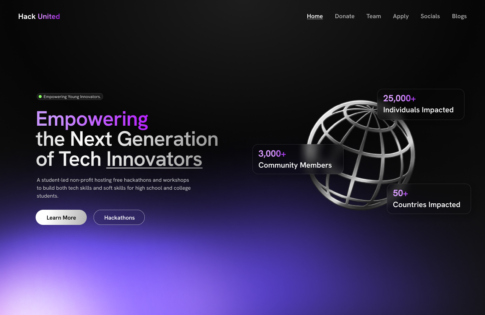
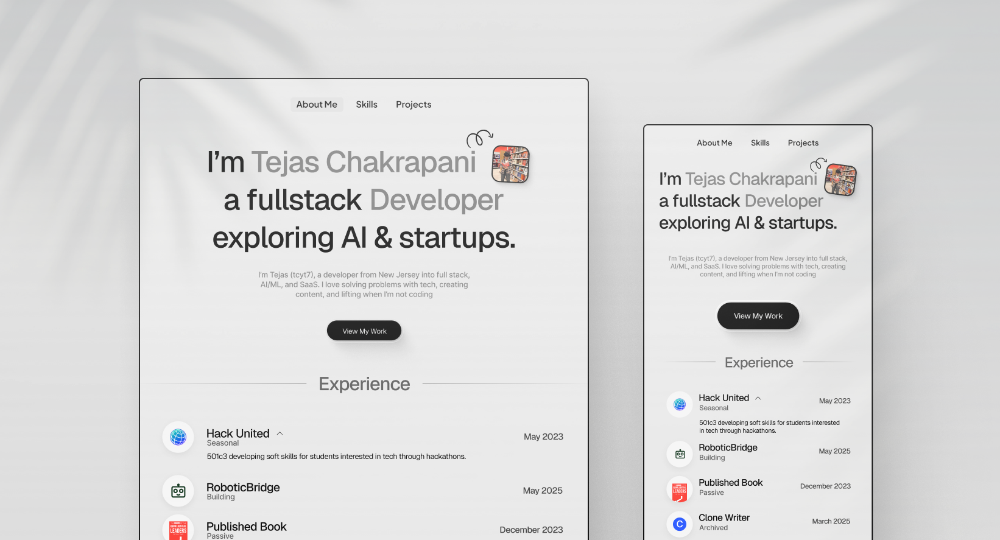
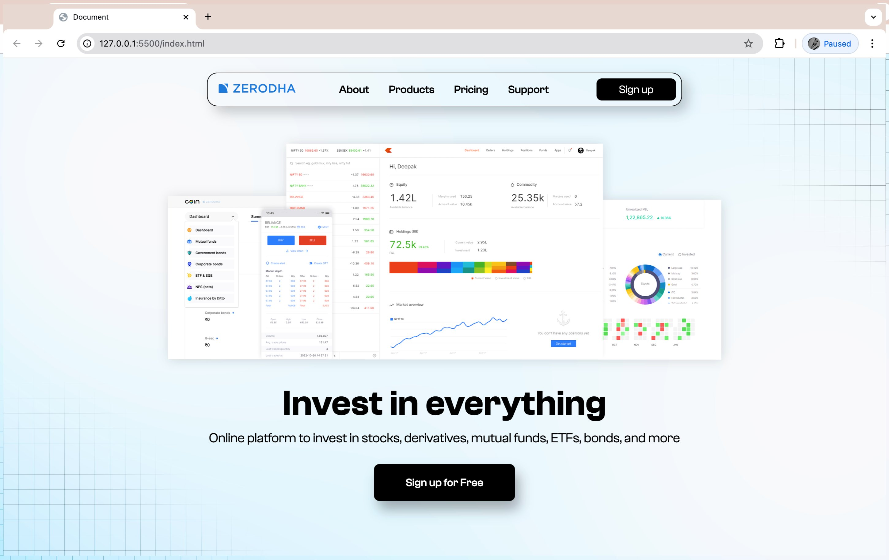
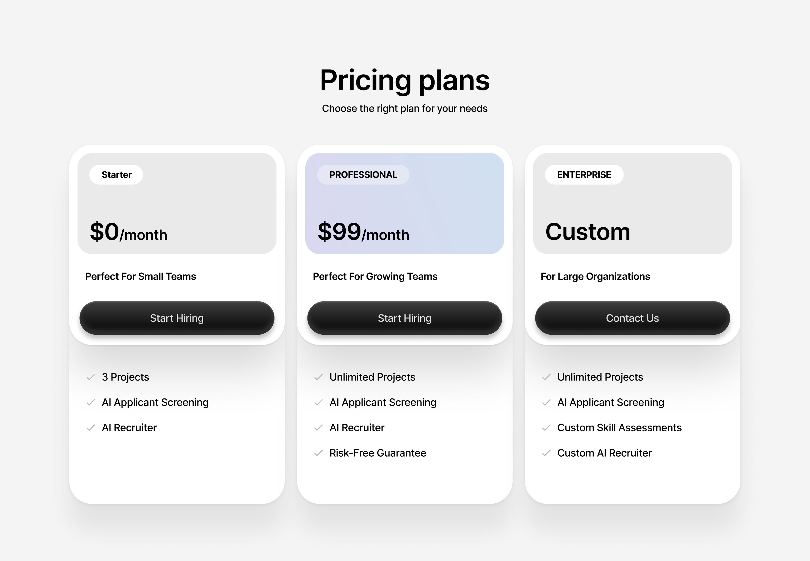

# My UI Design Showcase

A collection of interfaces and design concepts I've made using Figma.

| Design                          | Preview                                        | Link                                                                                                              |
| ------------------------------- | ---------------------------------------------- | ----------------------------------------------------------------------------------------------------------------- |
| Landing Page for HackUnited.org |   | [View on Figma](https://www.figma.com/design/KAATdmHnOvmmDQe3Fw3A6W/Untitled?node-id=0-1&t=XTI4ABh7wTtDqJ6a-1)    |
| PortFolio                       |  | [View on Figma](https://www.figma.com/design/4ABZYQEbDWLAd3kkg6zMSf/Untitled?node-id=236-20&t=TOpJMATRwCl3JFfb-1) |
| Zerodha Landing page Redesign   |   | [View on Twitter](https://x.com/prashant_kvian/status/1845742713695817959)                                        |
| Price Section                   |      | [View on Twitter](https://x.com/prashant_kvian/status/1956028339677749276)                                        |

---

### Tools Used

- Figma
- My design principles: Minimal, clean, consistent spacing
